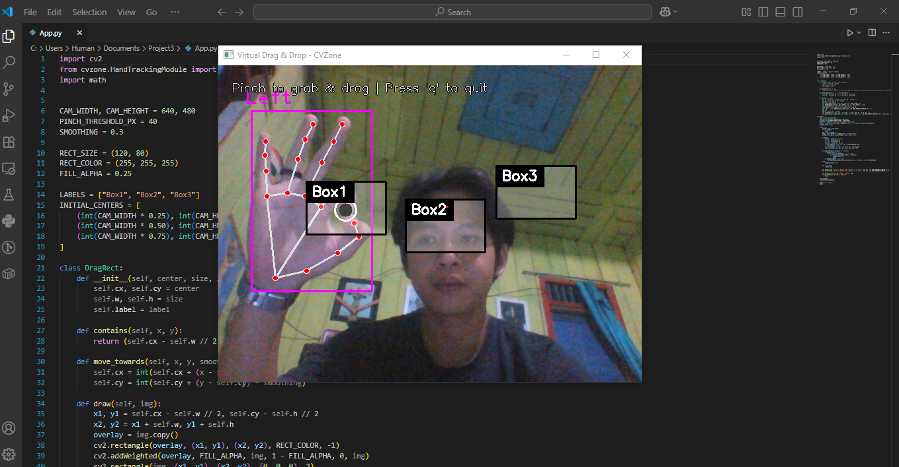

## 🎛 Virtual Drag & Drop with Hand Tracking (OpenCV + CVZone)
## 📌 Project Description
This project is a Computer Vision-based virtual drag & drop application that allows users to move objects on the screen simply by hand movements in front of the camera, without the need for a mouse or other physical input devices. By utilizing OpenCV for image processing, CVZone HandTrackingModule for hand detection, and Mediapipe for tracking key points (landmarks) on the hand, this system is able to recognize finger positions in real-time.

## 🎯 Key Features
- Real-Time Hand Tracking using your laptop/PC camera.
- Pinch-to-Grab Gesture: Move objects by pinching your thumb and index finger.
- Multi-Object Drag & Drop: Multiple objects can be moved independently.
- Smooth Motion: Smoother object movement with a smoothing system.
- Transparent Labels & Colors: Each object has a label and a semi-transparent visual effect.
- Easy Interaction: Simply use hand gestures in front of the camera.

## 🛠 Technologies Used
- Python 3
- OpenCV – image & video processing
- CVZone – hand tracking support module
- Mediapipe – hand point detection
- Math Library – finger distance calculation

## 📦 Installation
### 1. Clone repository:
```bash
git clone https://github.com/404-mind72/Virtual-Drag-Drop-with-Hand-Tracking-OpenCV-CVZone.git
```
### 2. Install Dependencies
```bash
pip install opencv-python cvzone mediapipe
```
## ▶ How to Run
1. Make sure your laptop/PC camera is active.
2. Run the program:
```bash
python App.py
```
3. Follow the on-screen instructions:
4. Point your hand at the camera.
5. Pinch your thumb and index finger to pick up an object.
6. Swipe your hand to move the object.
7. Release the pinch to place the object.
8. Press q to exit.

## 📷 Display Example
- Result 1
  


- Result 2
  


## 💡 Development Potential
- Multi-Hand Support: Supports simultaneous interaction with two hands.
- Custom Shapes: Add objects with customizable shapes and sizes.
- Additional Gestures: Rotate, resize, or delete objects with different gestures.
- AR Integration: Combine virtual objects with the real environment for a more immersive experience.
- Education Mode: Used for interactive learning without conventional input devices.

## 🚩Contributions
I would appreciate contributions to improve the model, add or enhance features, and optimize the deployment process. For any queries, reach out to me at joni150703@gmail.com

## 📄 License
This project is licensed under the MIT License.
Free to use, modify, and distribute.
